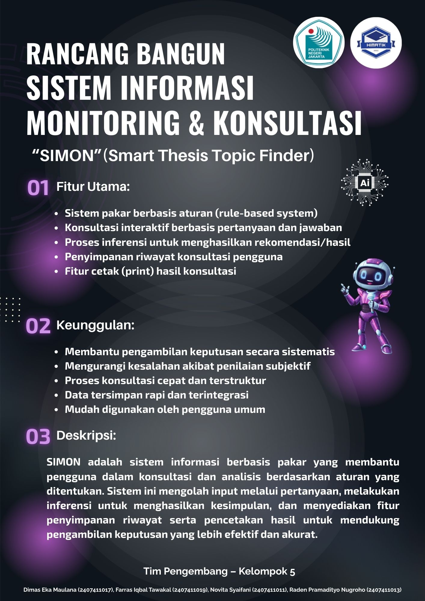
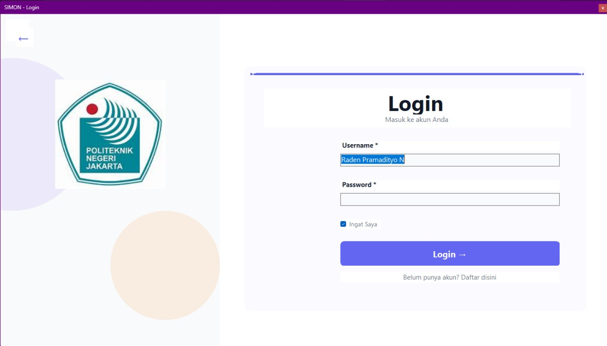
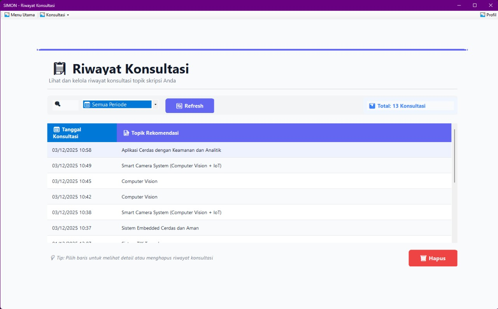

# 🎓 SIMON (Smart Thesis Topic Finder)

> **Intelligent Expert System for Student Thesis Topic Recommendations**

   
  <b>Project Overview & Key Features Summary:</b> 
  
   

---

## 📖 About The Project

**SIMON** (Smart Thesis Topic Finder) is a desktop-based information system designed to function as a monitoring and consultation tool. It specifically assists Informatics Engineering students in determining suitable thesis topics based on their individual interests and capabilities.

Students often face confusion when deciding the direction of their final project. This application serves as a comprehensive solution by utilizing an **Expert System** with a **Forward Chaining** method. It analyzes user responses to structured questions to provide precise, rule-based topic recommendations (such as AI, Software Engineering, Networking, IoT, or Data Science).

This project was developed as part of the coursework at **Politeknik Negeri Jakarta** (State Polytechnic of Jakarta).

---

## 🚀 Key Features

As highlighted in the project poster above, the main features include:

✅ **Rule-Based Expert System**: Utilizes structured rules to determine outcomes.
✅ **Interactive Consultation**: Question-and-answer based assessment to gauge student interests.
✅ **Inference Process**: Generates accurate recommendations based on user input.
✅ **History Tracking**: Securely stores previous consultation records for future reference.
✅ **Report Generation (Print)**: Exports consultation results into physical or digital documents.

---

## 📸 Application Gallery

Here is a glimpse of the SIMON user interface:

### 1. Registration & Login
Secure access pages for user authentication.

| Sign Up Page | Login Page |
| :---: | :---: |
|  |  |

### 2. Main Menu (Dashboard)
The navigation hub to access consultation and history features.

### 3. Consultation History
Review past topic recommendations.

---

## 🛠️ Tech Stack

* **Programming Language**: C#
* **Framework**: Microsoft .NET Framework 4.7.2
* **Database**: MySQL
* **Tools**: Visual Studio, XAMPP
* **Method**: Forward Chaining (Rule-Based System)

---

## 👥 Development Team (Group 5)

This project was created by students of **TI 3A - Politeknik Negeri Jakarta**:

* 👨‍💻 **Dimas Eka Maulana (Team leader)**
* 👨‍💻 **Farras Iqbal Tawakal (Back-End)**
* 👩‍💻 **Novita Syaifani (System Analyst)**
* 👨‍💻 **Raden Pramadityo Nugroho (Front End)**

---

## ⚙️ How to Run

1.  Clone this repository.
2.  Import the MySQL database provided in the `database/` folder to your localhost (XAMPP).
3.  Open the solution file (`.sln`) using Visual Studio.
4.  Adjust the database connection configuration if necessary in the project settings.
5.  Run the application (Start/F5).

---

  Made with ❤️ by Group 5 TI_3A

